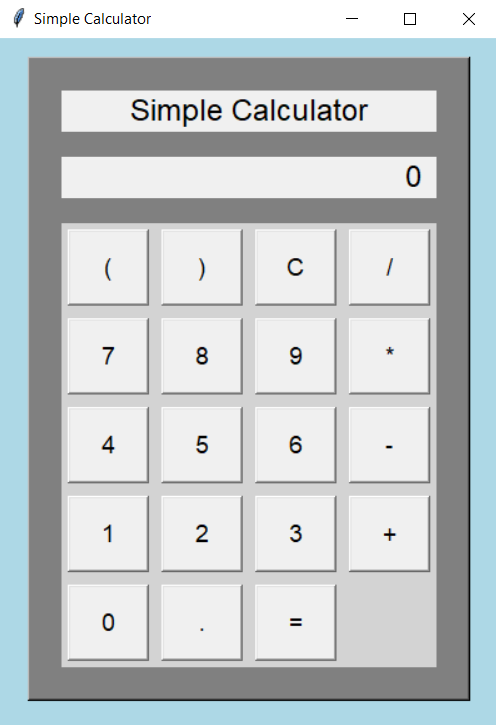

# Simple Calculator 

A clean, modern, and fully functional calculator built with Python and Tkinter.

Supports mouse and keyboard input, parentheses, decimals, and all basic math operations — packaged with a custom icon and available as a standalone `.exe`.

---

##  Features

- Addition, subtraction, multiplication, division
- Support for decimals and parentheses
- Full keyboard input support (`Enter` = `=`, `Escape` = `C`)
- Smart display behavior with error handling
- Custom icon and `.exe` release for Windows

---

## 🔧 How to Run

###  With Python (any OS):

Make sure you have Python 3.10+ installed.

```bash
python simple_calculator.py
```

---

###  With `.exe` (Windows only):

Download the precompiled `.exe` from the [Releases](https://github.com/your_username/your_repo_name/releases) tab and run it — no install required.

---

##  Screenshot



---

##  Building It Yourself

To create your own `.exe`, run:

```bash
pyinstaller --noconsole --onefile --icon=Simple_Calc_Icon.ico simple_calculator.py
```

This will generate the `.exe` inside a `/dist` folder.

---

## 📝 License

This project is licensed under the [MIT License](LICENSE).
